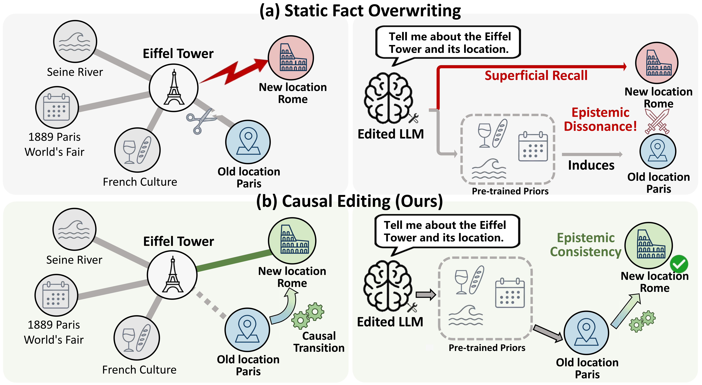
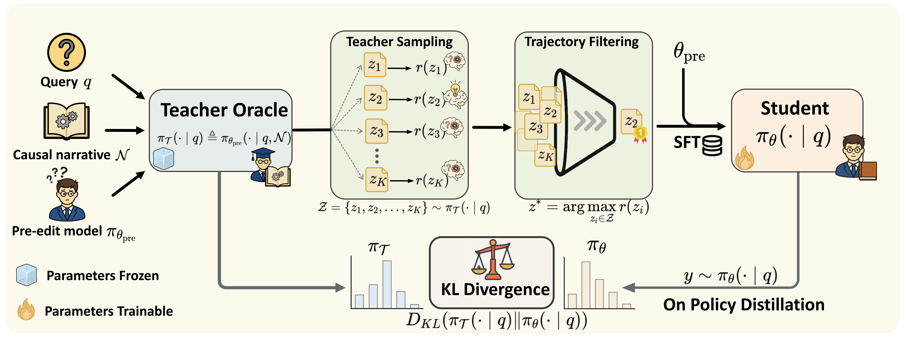

# CODE: Causal Editing via On-Policy Self-Distillation

Official repository for the paper: **"From Fact Overwriting to Knowledge Evolution: Causal Editing via On-Policy Self-Distillation"**.

## 💡 Overview

While Large Language Models (LLMs) require continuous updates to keep pace with an evolving world, the dominant Knowledge Editing (KE) paradigm—**Static Fact Overwriting**—treats LLMs like discrete databases by forcibly injecting isolated facts. This brute-force approach severs pre-trained logical topologies and triggers a critical pathology we expose as **Epistemic Dissonance**: the model initially retrieves the injected update but is quickly overwhelmed by un-evolved legacy priors, forcing it to explicitly negate its own claim.

To bridge the gap between static overwriting and genuine cognitive evolution, we introduce **CODE** (**C**ausal **O**n-policy **D**istillation for **E**diting). Instead of forcing superficial memorization, CODE anchors updates within explicit causal narratives, organically engraving the underlying transition logic directly into the model's parametric memory.

<p align="center">
  
</p>
<p align="center">
  <em><b>Figure 1: Static Fact Overwriting vs. Causal Editing.</b> <b>(a) Static Fact Overwriting</b> severs pre-trained topology to inject an isolated fact. During generation, un-evolved legacy priors strongly conflict with the new target, triggering Epistemic Dissonance. <b>(b) Causal Editing (Ours)</b> anchors the update within a causal transition. By bridging legacy history to the new state, the model autonomously deduces the updated fact, ensuring Epistemic Consistency.</em>
</p>

## ⚙️ How CODE Works (The Framework)

Standard offline distillation (e.g., SFT) suffers from severe exposure bias, allowing legacy priors to resurface during free-form generation. To genuinely internalize knowledge evolution, CODE employs a novel two-stage **on-policy self-distillation** framework:

1. **Causal Bootstrapping:** An open-book Teacher Oracle (conditioned on an explicit causal scaffold) curates high-confidence reasoning trajectories to initialize the closed-book Student via SFT, preventing optimization collapse.
2. **Causal Internalization:** An asymmetric on-policy distillation process minimizes the KL divergence. By aligning the actively exploring Student with the Teacher's conditional distribution, the causal transition logic is permanently engraved into the pre-trained topology.

<p align="center">
  
</p>
<p align="center">
  <em><b>Figure 2: Overview of the CODE framework.</b> (1) Causal Bootstrapping establishes a reasoning prior. (2) Causal Internalization enforces an information bottleneck, internalizing the causal transition logic directly into the model's parametric memory.</em>
</p>


## ✨ Key Features

- 🛡️ **Eliminates Epistemic Dissonance:** Suppresses the structural self-refutation rate from a catastrophic ~95% down to just **1.8%**.
- 🧠 **Robust Multi-hop Reasoning:** Transforms superficial recall into deep structural knowledge, boosting multi-hop portability up to **83.5%** on MQuAKE.
- ⚡ **Zero Inference Latency:** Internalizes causal logic directly into parametric weights—requiring no external RAG or routing modules during inference.
- 🔒 **Preserves General Capabilities:** Safely assimilates new knowledge without the severe catastrophic forgetting typical of heavy data-augmentation baselines.

---

## 🛠️ Installation

We highly recommend using [`uv`](https://docs.astral.sh/uv/) for lightning-fast environment setup. Create a virtual environment with **Python 3.12** and install the dependencies:

```bash
uv venv --python 3.12
source .venv/bin/activate

# Due to potential version conflicts, installing packages sequentially is recommended
uv pip install -r requirements.txt
```

> ⚠️ **Important Installation Notes:**
> - **Unsloth & vLLM:** This project depends on `unsloth==2026.3.18` and `unsloth-zoo==2026.3.7` for highly optimized LoRA training and fast vLLM inference.
> - **Flash Attention:** `flash-attn` is intentionally omitted from `requirements.txt`. Please download the pre-built wheel matching your CUDA/Python version from the [flash-attention releases](https://github.com/Dao-AILab/flash-attention/releases) and install it manually:
>   `uv pip install /path/to/flash_attn-2.8.3+cu12torch2.8cxx11abiFALSE-cp312-cp312-linux_x86_64.whl`

---

## 📂 Data Preparation

We evaluate CODE primarily on **MQuAKE-CF-v2** (Counterfactual updates) and **MQuAKE-T** (Temporal updates). To enable causal editing, we augment each update with an explicit causal narrative (cognitive scaffold).

The fully processed datasets with pre-generated causal narratives are available in the [`CODE/datasets/`](CODE/datasets/) directory:
- 📄 [`CODE/datasets/MQuAKE-CF-3k-v2_causalenhanced.json`](CODE/datasets/MQuAKE-CF-3k-v2_causalenhanced.json)
- 📄 [`CODE/datasets/MQuAKE-T_causalenhanced.json`](CODE/datasets/MQuAKE-T_causalenhanced.json)

*(If you wish to generate causal narratives for your own custom datasets, please refer to [Step 1](#step-1-generate-causal-narratives) below.)*

---

## 🚀 Quick Start

The complete pipeline consists of three steps: **(1)** Generate causal narratives, **(2)** Run editing experiments, and **(3)** Evaluate results using LLM-as-a-Judge.

### Step 1: Generate Causal Narratives (Optional)

> **Skip this step** if you are using our provided datasets in `CODE/datasets/`. 

The `CausalScaffold/` module queries Wikidata for entity backgrounds and utilizes an LLM to synthesize logical causal transition articles.

```bash
cd CausalScaffold

# Generate causal scaffolds for MQuAKE-CF-3k-v2
python generate.py \
    --generate_model_name deepseek-v3.2 \
    --verify_model_name deepseek-v3.2 \
    --api_key "YOUR_API_KEY" \
    --base_url "YOUR_BASE_URL" \
    --mquake_file ../CODE/datasets/MQuAKE-CF-3k-v2-cake.json \
    --grounding_info_file ./grounding_info_cf.json \
    --generated_articles_file ./generated_articles_cf.json \
    --merged_file ../CODE/datasets/MQuAKE-CF-3k-v2_causalenhanced.json
```
*This script automatically handles Wikidata grounding, LLM generation + verification, and final dataset merging.*

### Step 2: Run Editing Experiments

Use `CODE/test_causaledit.py` to run knowledge editing experiments. The script supports multiple editing methods and evaluation configurations.

#### Basic Usage

```bash
cd CODE

# CausalEdit on MQuAKE-CF-3k-v2 with Qwen2.5-7B
# Uses datasets/MQuAKE-CF-3k-v2_causalenhanced.json by default
python test_causaledit.py \
    --editing_method CausalEdit \
    --datatype MQuAKE-CF-3k-v2 \
    --model_type qwen2.5-7b-instruct \
    --max_cases 400 \
    --shuffle_seed 70 \
    --hop 2 \
    --exp_tag 2-hop

# CausalEdit on MQuAKE-T with Llama-3.1-8B
# Uses datasets/MQuAKE-T_causalenhanced.json by default
python test_causaledit.py \
    --editing_method CausalEdit \
    --datatype MQuAKE-T \
    --model_type llama3.1-8b-instruct \
    --max_cases 400 \
    --shuffle_seed 70 \
    --hop 2 \
    --exp_tag 2-hop
```

#### CausalEdit Configuration

CausalEdit's default hyperparameters are defined in [`causaledit.py`](CODE/EasyEdit/easyeditor/models/causaledit/causaledit.py). To override defaults, use a different `--model_type` to match the corresponding YAML config under `CODE/EasyEdit/hparams/CausalEdit/`:

- [`llama3.1-8b-instruct`](CODE/EasyEdit/hparams/CausalEdit/llama3.1-8b-instruct.yaml) / [`qwen2.5-7b-instruct`](CODE/EasyEdit/hparams/CausalEdit/qwen2.5-7b-instruct.yaml) — Default
- [`llama3.1-8b-instruct_cake`](CODE/EasyEdit/hparams/CausalEdit/llama3.1-8b-instruct_cake.yaml) / [`qwen2.5-7b-instruct_cake`](CODE/EasyEdit/hparams/CausalEdit/qwen2.5-7b-instruct_cake.yaml) — With CAKE data augmentation
- [`llama3.1-8b-instruct_noncausal`](CODE/EasyEdit/hparams/CausalEdit/llama3.1-8b-instruct_noncausal.yaml) / [`qwen2.5-7b-instruct_noncausal`](CODE/EasyEdit/hparams/CausalEdit/qwen2.5-7b-instruct_noncausal.yaml) — Ablation: non-causal mode
- [`llama3.1-8b-instruct_reversekl`](CODE/EasyEdit/hparams/CausalEdit/llama3.1-8b-instruct_reversekl.yaml) / [`qwen2.5-7b-instruct_reversekl`](CODE/EasyEdit/hparams/CausalEdit/qwen2.5-7b-instruct_reversekl.yaml) — Ablation: Reverse KL

For example, to run the CAKE-augmented variant:
```bash
python test_causaledit.py \
    --editing_method CausalEdit \
    --datatype MQuAKE-CF-3k-v2 \
    --model_type qwen2.5-7b-instruct_cake \
    --max_cases 400 \
    --shuffle_seed 70 \
    --hop 2 \
    --exp_tag 2-hop
```

#### Key Arguments

| Argument | Default | Description |
|----------|---------|-------------|
| `--editing_method` | required | Editing method name |
| `--datatype` | None | Dataset type: `MQuAKE-CF-3k-v2` or `MQuAKE-T` |
| `--model_type` | None | Model identifier (maps to hparams YAML) |
| `--max_cases` | 200 | Maximum number of test cases |
| `--hop` | None | Filter by hop count (1/2/3/4) |
| `--shuffle_seed` | 70 | Data shuffle seed |
| `--exp_tag` | "" | Experiment tag for output directory |
| `--batch_edit` | 0 | Enable batch edit mode with N unique edit units (≤0 = disabled) |
| `--skip_cases` | 0 | Skip first N cases (resume from checkpoint) |
| `--hparams_path` | None | Custom hyperparameters YAML path |

#### Batch Editing

```bash
python test_causaledit.py \
    --editing_method CausalEdit \
    --datatype MQuAKE-T \
    --model_type qwen2.5-7b-instruct \
    --shuffle_seed 70 \
    --hop 2 \
    --exp_tag 2-hop-batch \
    --batch_edit 90
```

#### Output Structure

```
output/experiments/{datatype}/{model_type}/{editing_method}/tag-{exp_tag}/n{case_count}_seed{seed}_{run_id}/
├── metrics.json          # Per-case evaluation metrics
├── res.json              # Averaged results
├── requests.json         # Edit requests and predictions
└── meta/
    ├── run_args.json     # CLI arguments
    └── run_info.json     # Run metadata + hparams
```

### Step 3: Evaluate and Analyze Results

> ⚠️ **Before running evaluation**, you must configure your API key in `pred_analysis_tool.py`:
> ```python
> # CODE/pred_analysis_tool.py, line ~47
> API_KEY_POOL = [
>     "your_api_key_here",  # Replace with your actual API key
> ]
> ```

We use an LLM-as-a-Judge framework (`pred_analysis_tool.py`) to systematically evaluate Hop-wise Accuracy (H-Acc), Multi-hop Accuracy (M-Acc), and the Self-Refutation Rate (SRR).

**1. Accuracy Evaluation (H-Acc & M-Acc):**
```bash
python pred_analysis_tool.py judge \
    --input ./output/experiments/MQuAKE-CF-3k-v2/.../metrics.json \
    --judge-model deepseek-v4-flash
```

**2. Epistemic Dissonance Analysis (SRR & Rationale Alignment):**

```bash
# Detect Epistemic Dissonance (Self-Refutation Rate)
python pred_analysis_tool.py analyze \
    --input ./output/experiments/.../metrics.json \
    --llm-self-refute on

# Check Rationale Alignment for "Why?" questions
python pred_analysis_tool.py analyze \
    --input ./output/experiments/.../metrics.json \
    --llm-self-refute on \
    --rewrite-why on
```
> **Note:** Consistent with the paper, we report SRR using the `Combined (any source), among rewrites with hop_wise_pred assertion_of_target_new=true` metric in the generated summary file `analysis/pred_analysis.txt`.

---

## 🤝 Acknowledgements

We would like to express our profound gratitude to the [ZJUNLP](https://github.com/zjunlp) group for their phenomenal open-source contributions to the Knowledge Editing community. Portions of our baseline evaluation pipeline are built upon their foundational repositories:
* **[EasyEdit](https://github.com/zjunlp/EasyEdit/tree/main/easyeditor)**: A robust framework for LLM editing.
* **[CaKE](https://github.com/zjunlp/cake)**: Circuit-Aware Knowledge Editing.
